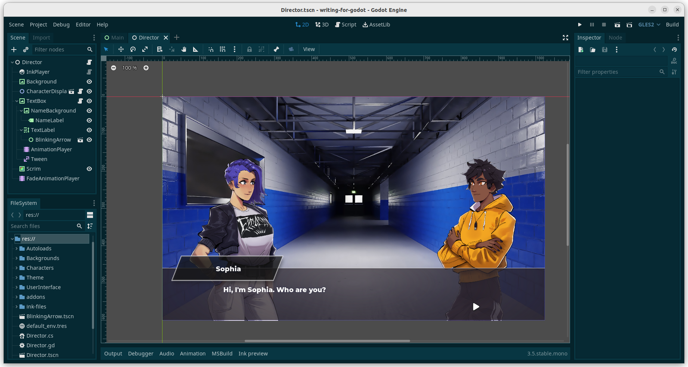

# Writing for Godot: A Visual Novel Framework

This is a demo project and framework for using [Ink](https://www.inklestudios.com/ink/), the narrative scripting language, in visual novels made in the open source game engine [Godot](https://godotengine.org/). This mainly entails setting up a project structure and writing some scripts to connect Paul's excellent [Godot-Ink plugin](https://github.com/paulloz/godot-ink) to Godot in ways that make writing a VN as easy as possible.

My goal is to have a system in which one can write the story and test the choices entirely in Ink, then import the finished Ink script, plus background and sprite graphics, into a Godot project, and have everything Just Work. **It's not there yet**, so please don't download this project expecting to build a Godot-Ink VN with a few clicks. However, if you're a Godot programmer interested in picking through the code, please feel free to fork it.

I'm borrowing a lot of the overall structure and a good bit of code from the outstanding VN tutorial in [GDquest's](https://www.gdquest.com/) "2D Secrets" course. While the GDQuest tutorial costs money, the code and resources in it are all under the MIT license, and I've also used the MIT license on this repo so we can keep the free code flowing.

## Project structure

Here's a screenshot showing most of the project's structure:

The `Director` node controls everything, and interacts with the `InkPlayer` to read the current text, tags, and choices and send them to the appropriate child nodes for processing and display. I've adopted theater terminology for the most part; besides a `Director` calling the shots, we have a `Scrim`, which is a `ColorRect` that sits in front of the scene and handles things like fading in and out. 

One of the many solid design choices I borrowed from the GDQuest tutorial was to set up a `ResourceDB` autoload that pulls all of the sprites, backgrounds, and other resources in at game startup. That means each asset needs to be imported into its own resource (see the `community_garden.tres` background, for example). 

To do that, right click in the file manager in Godot, choose "New Resource" from the contextual menu, and then search for the appropriate resource type (`Character` and `Background` are currently supported, and I'll be adding more soon). Then add an Object in the "Script Variables" section, and finally drag and drop the file with your texture into it (e.g. `community_garden.jpg`). That needs to be done with each character sprite and background graphic. While it may seem cumbersome, this is a more robust approach than using something like filename extensions, as the `ResourceDB` actually does type checks to make sure each resource it's loading is what it says it is.

## Tag processing

The Ink script I'm writing for this demo will demonstrate the various features I've built into the system. My general strategy is to have the Director turn each tag into an array, which it then parses. If the first word in the tag is a function name, it will execute that function and send the remaining words as arguments to it.

For example, the tag:

`# background community_garden`

will call the `background` function and send `community_garden` as an argument. That function then loads the named background resource and displays it as, you guessed it, the background. 

This should make the system very flexible, as anyone who wants to add new functions just has to put them into the `Director.gd` file, and then call them with appropriate arguments in their Ink. 